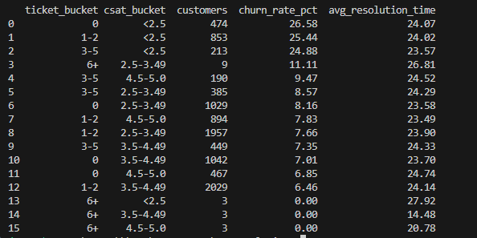

# Customer Churn & Retention Analytics

SQL (DuckDB) · Python (Pandas) · Exploratory Data Analysis · Business Insights

---

## 📖 Overview

This repository contains an end-to-end data analytics project focused on understanding and reducing **customer churn** in a subscription-based business.

The project demonstrates a **production-style analytics workflow**:
- SQL-first KPI and segmentation analysis
- Pandas-based exploratory analysis and validation
- Business-focused insights and recommendations

---

## 🎯 Objectives

- Measure overall customer churn and revenue at risk  
- Identify behavioral, billing, and support-related churn drivers  
- Segment customers by churn risk  
- Translate analytical findings into actionable business recommendations  

---

## 🧾 Dataset

- **Size:** 10,000 customers  
- **Target Variable:** `churn` (0 = No, 1 = Yes)  
- **Domain:** SaaS / Subscription / Service businesses  
- **Source:** Synthetic dataset generated using business-driven rules  

### Feature Categories
- Customer profile & tenure  
- Product usage & engagement  
- Billing & payment history  
- Customer support & satisfaction  
- Marketing engagement & feedback  

---

## 🛠 Tech Stack

- **SQL:** DuckDB  
- **Python:** Pandas, NumPy, Matplotlib  
- **Environment:** Python virtual environment (`.venv`)  
- **Version Control:** Git & GitHub  

---
## 📂 Repository Structure

```text
customer-churn-analytics/
├── data/
│   └── customer_churn_business_dataset.csv
├── sql/
│   ├── 01_create_tables.sql
│   ├── 02_kpi_metrics.sql
│   └── 03_segment_analysis.sql
├── notebooks/
│   └── churn_analysis.ipynb
├── init_db.py
├── run_sql.py
├── requirements.txt
└── README.md
---
```
## 🔍 Methodology

### SQL Analysis (DuckDB)
- Loaded raw CSV data into a relational table
- Computed core KPIs:
  - Churn rate
  - Revenue at risk
  - Churn by tenure, contract type, and signup channel
- Analyzed churn drivers across:
  - Engagement and inactivity
  - Billing and payment failures
  - Customer support interactions
- Built rule-based churn risk segmentation

### Python Analysis (Pandas)
- Queried data directly from DuckDB
- Performed exploratory data analysis (EDA)
- Validated SQL results
- Visualized churn drivers and customer behavior
- Estimated revenue-at-risk scenarios

---

## 📊 Key Findings

- Customers in their **first 6 months** show the highest churn risk  
- **Low engagement** (≤8 monthly logins) and **high inactivity** (≥14 days) are strong churn indicators  
- **Billing issues**, especially repeated payment failures, significantly increase churn probability  
- **Customer support experience** matters:
  - High ticket volume
  - Escalations
  - Low CSAT scores  
- Revenue risk is **highly concentrated**, with a small group of customers accounting for a large share of potential loss  

---

## 💡 Business Impact

- Quantified **monthly and lifetime revenue at risk** due to churn  
- Identified **high-risk, high-value customer segments**  
- Demonstrated how reducing churn by **1–2%** can materially improve recurring revenue  

---

## ✅ Recommendations

- Improve onboarding and early engagement during the first 30 days  
- Trigger retention actions for low-activity and inactive users  
- Proactively intervene on billing failures  
- Prioritize outreach for customers with poor support experiences  
- Use churn risk segmentation to guide targeted retention campaigns  

---

## 📸 Results 

### SQL KPI Output


### Churn by Tenure


### Engagement vs Churn


### Revenue at risk


---

## ▶️ How to Run

```bash
# Create and activate virtual environment
python -m venv .venv
.venv\Scripts\activate

# Install dependencies
pip install -r requirements.txt

# Initialize database
python init_db.py

# Run SQL analysis
python run_sql.py

# Open EDA notebook
notebooks/churn_analysis.ipynb


